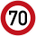
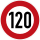

# 🇧🇪 België

Maximumsnelheden
----------------

[OpenNWB](../README.md) kent de volgende Belgische standaardmaximumsnelheden (in km/h).
Maximumsnelheden uit `maxspeed`-tags worden in België alleen weergegeven als ze verschillen van deze standaardmaximumsnelheden.

### Vlaanderen

| Wegcategorie |  |  |
| :----------- | :-----------------------------------------------: | :-------------------------------------: |
| Woongebied (erf) |  |  |
| Fietsstraat (FS) |  |  |
| Andere wegen |  |  |
| Autosnelweg (ASW) |  |  |

### Wallonië

| Wegcategorie |  |  |
| :----------- | :-----------------------------------------------: | :-------------------------------------: |
| Woongebied (erf) |  |  |
| Fietsstraat (FS) |  |  |
| Andere wegen |  |  |
| Autosnelweg (ASW) |  |  |

### Brussel

| Wegcategorie |  |  |
| :----------- | :-----------------------------------------------: | :-------------------------------------: |
| Woongebied (erf) |  |  |
| Fietsstraat (FS) |  |  |
| Andere wegen |  |  |
| Autosnelweg (ASW) |  |  |

Wegbeheerders
-------------

Met de juiste tagging kunnen de volgende Belgische wegbeheerders worden onderscheiden:

* 3 [gewesten](../road-operators/gewesten.md);
* [Waalse Maatschappij voor de Aanvullende Financiering van de Infrastructuren](../road-operators/other.md);
* 10 [provincies](../road-operators/provincies.md);
* 565 [gemeenten](../road-operators/gemeenten.md);
* [andere wegbeheerders](../road-operators/other.md).
