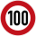
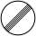

# 🇩🇪 Bondsrepubliek Duitsland

Maximumsnelheden
----------------

[OpenNWB](../README.md) kent de volgende Duitse standaardmaximumsnelheden (in km/h).
Maximumsnelheden uit `maxspeed`-tags worden in Bondsrepubliek Duitsland alleen weergegeven als ze verschillen van deze standaardmaximumsnelheden.

| Wegcategorie | Binnen de bebouwde kom (bibeko) | Buiten de bebouwde kom |
| :----------- | :-----------------------------: | :--------------------: |
| Woongebied (erf) | stapvoets | stapvoets |
| Fietsstraat (FS) |  |  |
| Andere wegen |  |  |
| Autosnelweg (ASW) |  |  |

Wegbeheerders
-------------

Met de juiste tagging kunnen de volgende Duitse wegbeheerders worden onderscheiden:

* 11 [landen](../road-operators/landen.md);
* [Die Autobahn GmbH des Bundes](../road-operators/other.md);
* 104 [gemeenten](../road-operators/gemeenten.md);
* [andere wegbeheerders](../road-operators/other.md).
