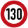

# 🇫🇷 Frankrijk

Maximumsnelheden
----------------

[OpenNWB](../README.md) kent de volgende Franse standaardmaximumsnelheden (in km/h).
Maximumsnelheden uit `maxspeed`-tags worden in Frankrijk alleen weergegeven als ze verschillen van deze standaardmaximumsnelheden.

| Wegcategorie | Binnen de bebouwde kom (bibeko) | Buiten de bebouwde kom |
| :----------- | ------------------------------: | ---------------------: |
| Woongebied (erf) |  |  |
| Andere wegen |  |  |
| Autosnelweg (ASW) |  |  |

Wegbeheerders
-------------

Met de juiste tagging kunnen de volgende Franse wegbeheerders worden onderscheiden:

* 12 wegbeherende diensten van de [Franse Staat](../road-operators/landen.md);
* 4 [gewesten](../road-operators/gewesten.md);
* [Routes de Guadeloupe](../road-operators/other.md);
* [bijzondere Franse gemeente Parijs](../road-operators/gemeenten.md);
* [andere wegbeheerders](../road-operators/other.md).
