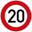
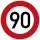

# 🇱🇺 Luxemburg

Maximumsnelheden
----------------

[OpenNWB](../README.md) kent de volgende Luxemburgse standaardmaximumsnelheden (in km/h).
Maximumsnelheden uit `maxspeed`-tags worden in Luxemburg alleen weergegeven als ze verschillen van deze standaardmaximumsnelheden.

| Wegcategorie | Binnen de bebouwde kom (bibeko) | Buiten de bebouwde kom |
| :----------- | :-----------------------------: | :--------------------: |
| Woongebied (erf) |  |  |
| Fietsstraat (FS) |  |  |
| Andere wegen |  |  |
| Autosnelweg (ASW) |  |  |

Wegbeheerders
-------------

Met de juiste tagging kunnen de volgende Luxemburgse wegbeheerders worden onderscheiden:

* Administratie Bruggen en Wegen ([Staat van het Groothertogdom Luxemburg](../road-operators/landen.md));
* 100 [gemeenten](../road-operators/gemeenten.md);
* [andere wegbeheerders](../road-operators/other.md).
