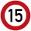
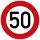
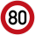
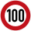
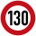
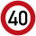
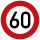
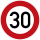

# 🇳🇱 Nederland

Maximumsnelheden
----------------

[OpenNWB](../README.md) kent de volgende Nederlandse standaardmaximumsnelheden (in km/h).
Maximumsnelheden uit `maxspeed`-tags worden in Nederland alleen weergegeven als ze verschillen van deze standaardmaximumsnelheden.

| Wegcategorie | Binnen de bebouwde kom (bibeko) | Buiten de bebouwde kom |
| :----------- | :-----------------------------: | :--------------------: |
| Woongebied (erf) |  |  |
| Andere wegen |  |  |
| Autoweg (AW) |  |  |
| Autosnelweg (ASW) |  |  |

### Bonaire

| Wegcategorie | Binnen de bebouwde kom (bibeko) | Buiten de bebouwde kom |
| :----------- | :-----------------------------: | :--------------------: |
| Alle wegen |  |  |

### Sint Eustatius

| Wegcategorie | Binnen de bebouwde kom (bibeko) | Buiten de bebouwde kom |
| :----------- | :-----------------------------: | :--------------------: |
| Alle wegen |  |  |

### Saba

| Wegcategorie | Binnen de bebouwde kom (bibeko) | Buiten de bebouwde kom |
| :----------- | :-----------------------------: | :--------------------: |
| Alle wegen |  |  |

Wegbeheerders
-------------

Met de juiste tagging kunnen de volgende Nederlandse wegbeheerders worden onderscheiden:

* Rijkswaterstaat ([Staat der Nederlanden](../road-operators/landen.md));
* 12 [provincies](../road-operators/provincies.md);
* 21 [waterschappen](../road-operators/waterschappen.md);
* 345 [gemeenten](../road-operators/gemeenten.md);
* [andere wegbeheerders](../road-operators/other.md).
