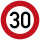
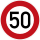

# 🇸🇽 Sint Maarten

Maximumsnelheden
----------------

[OpenNWB](../README.md) kent de volgende Sint Maartense standaardmaximumsnelheden (in km/h).
Maximumsnelheden uit `maxspeed`-tags worden in Sint Maarten alleen weergegeven als ze verschillen van deze standaardmaximumsnelheden.

| Wegcategorie | Binnen de bebouwde kom (bibeko) | Buiten de bebouwde kom |
| :----------- | ------------------------------: | ---------------------: |
| Alle wegen |  |  |

Wegbeheerders
-------------

Met de juiste tagging kunnen de volgende Sint Maartense wegbeheerders worden onderscheiden:

* Infrastructuurbeheer ([Land Sint Maarten](../road-operators/landen.md));
* [andere wegbeheerders](../road-operators/other.md).
